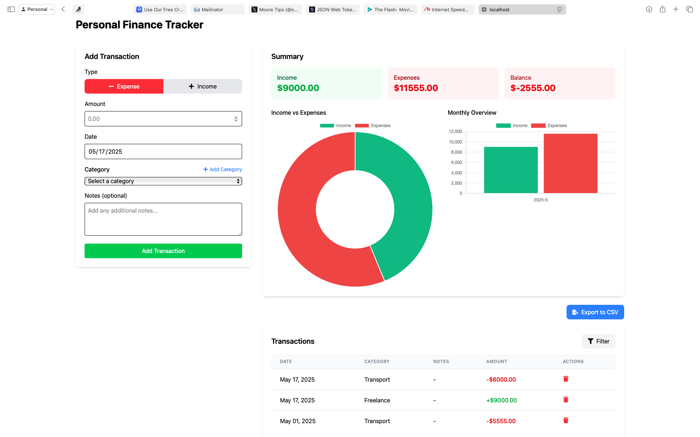

# Personal Finance Tracker

A comprehensive application for tracking personal finances, enabling users to monitor and analyze their income and expenses with categorization and filtering options.



## Features

- **Transaction Management**
    - Add income and expense transactions
    - View all transactions in a clean table layout
    - Delete transactions as needed

- **Detailed Categorization**
    - Default categories provided (Salary, Food, Transport, etc.)
    - Create custom categories for income and expenses
    - Categories persist between sessions

- **Advanced Filtering**
    - Filter by transaction type (income/expense/all)
    - Filter by specific category
    - Filter by date range

- **Visual Analytics**
    - Income vs. expense doughnut chart
    - Monthly overview bar chart
    - Summary cards showing totals

- **Data Export**
    - Export all transactions to CSV format

## Technologies Used

- React.js with TypeScript
- Tailwind CSS for styling
- date-fns for date handling
- Chart.js for data visualization
- React Icons for icon set

## Installation

1. Clone the repository:
   ```bash
   git clone https://github.com/yourusername/personal-finance-tracker.git